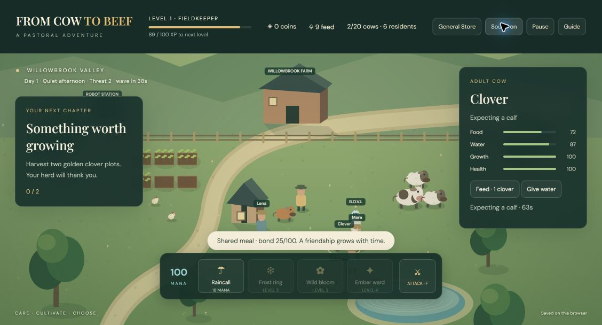

# From Cow to Beef

A standalone farm-building action RPG for desktop and touch browsers. Grow a peaceful herd, cultivate crops, build a settlement and defend it with weapons and magic. Processing a cow is optional; care, farming, quests and breeding all earn experience.

## Play

[Play From Cow to Beef](https://from-cow-to-beef.meat-lover-bc0.workers.dev/)

[Source repository](https://github.com/9khfghvzzw-dotcom/from-cow-to-beef)



## Features

- Layered canvas landscape, animated animals, depth sorting, shadows and lighting.
- Cows, breeding sheep, egg-laying chickens and a farm dog; sheep can grow and go to market, while a farmer autonomously prioritizes any farm animal in need and residents help defend the settlement.
- Chickens lay sellable eggs, with a rare golden egg that can be sold or hatched into a golden chicken. Adult cows produce collectible, sellable milk without being sent to market.
- Six spells, including purchasable lightning and sanctuary magic, plus three permanent special-arrow upgrades.
- XP, levels and quests. A breeding robot travels to a healthy adult cow, performs artificial insemination and starts a timed pregnancy. Herds and settlements have no gameplay cap.
- A General Store organized into seeds/produce, homes/defenses, weapons and household categories.
- Plant clover, carrots, wheat, tea and valuable saffron; buy additional fields with six plots each, without a field limit.
- Place cottages, barns and defensive walls. Settlement growth and player level increase enemy pressure from wolves, dire wolves and high-level vampires. Buy an expanding weapon roster or electric Voltwarden robots to defend the herd.
- An optional household story with an adult human or robot companion, shared meals, and a human, hybrid or android child who helps defend the settlement.
- Original soundtrack supplied by the project owner, with an explicit sound toggle.
- Local saves, pause, field guide, keyboard, mouse and touch controls. All shop purchases use earned game coins.

## Controls

| Action                   | Control                                                    |
| ------------------------ | ---------------------------------------------------------- |
| Move                     | WASD / arrows, click ground, or touch direction buttons    |
| Interact                 | Select an animal, crop or building; use the action panel   |
| Spells                   | 1–4 or spell buttons                                       |
| Attack wolves            | F or Attack                                                |
| Build                    | Select a building in General Store, then click open ground |
| Pause / cancel placement | Escape                                                     |

## Run locally

Requires Node.js compatible with Vite 8 (tested with Node 24).

```sh
npm ci
npm run dev
npm test
npm run build
```

The development server uses `http://127.0.0.1:5180/`. Production output is in `dist/`; upload its contents as Cloudflare Worker static assets. No backend, API keys or paid services are required by the game.

To update the existing Cloudflare deployment with an authorized account:

```sh
npm run build
npx wrangler@4.129.0 deploy
```

`wrangler.jsonc` identifies this game's standalone Worker. For your own deployment, change its account ID and Worker name. Cloudflare authentication is stored outside the repository.

## Architecture and validation

- `src/world.js`: browser-independent simulation, economy, NPC decisions, combat, breeding and persistence.
- `src/render.js`: canvas rendering and camera.
- `src/main.js`: input, HUD, audio and save lifecycle.
- `src/dom.js`: incremental updates that preserve live interaction controls.
- `src/settlement-ui.js`: categorized store and settlement actions.
- `tests/`: deterministic Node tests covering progression, breeding reservations, NPCs, spells, crops, construction, combat, household and save validation.

Validation: 44 passing simulation tests and a successful production build. The tests cover progression, animal care, sheep breeding and sales, eggs and golden chickens, dairy production, land expansion, premium crops, advanced magic and arrows, android defense, stronger level-scaled enemies, engineering, repair costs and save migration.

[Mobile screenshot](docs/mobile.png)

Time stops when the tab is hidden, a dialog is open or the game is paused. Saves belong to the current browser and origin; clearing site data removes them. This is a single-player browser game, not a signed native iPhone app. A network connection is needed for initial loading; this release does not claim installable offline support.

Code and artwork are provided here for portfolio review. No redistribution license has been granted for the supplied soundtrack.

Combat uses health, visible traveling arrows, damage numbers, enemy death and collectible loot. Sell fur, fangs and essence in General Store → Monster loot. Residents prioritize nearby attackers, then care for animals and water/harvest crops.

Magic: fireballs deal damage on arrival; lightning connects to up to four targets within 320 units; frost expands before freezing; rain/bloom mark affected targets; sanctuary stays visible for 12 seconds. Adult citizens reserve separate jobs, spend owned seeds when planting, and interrupt work to divide nearby attackers.

Citizens have happiness, individual player connection, contextual facial expressions, spontaneous short conversations, dialogue choices and a four-choice persuasion round. Repeated approaches have diminishing positive impact; nearby danger changes reactions. These are authored rule-based conversations, without an external AI service.

Livestock expansion: shear adult sheep for wool (9 gold each); buy and sell sheep, chickens and dogs. Two adult dogs produce a puppy that matures in 180 seconds. Sheep shelters, chicken coops and kennels restore needs nearby. Buy goldfish tanks, shark aquariums and piranha defense pools, then stock them from Livestock & fish. Two adult fish in the same habitat reproduce every 150 seconds; offspring must mature before sale. Adult piranhas deal 4 damage/second to enemies inside the pool. Crop inventories now initialize every crop and repair missing/invalid quantities in older saves. Unit sale prices remain visible even with zero stock. Validation: 49 tests and desktop/touch browser purchase and sale checks.

Household choices: Lena and Noah (human adults, free companion invitation), Ari-7 and blonde Nova-8 (original android adults, 100 game gold). Invite independent residents for 75 gold (human) or 100 gold (android), with a cottage required. Existing companions can change appearance within their type without losing family progress. A player family unlocks at level 3 with bond 100 or connection 80 and costs 80 gold. New babies rest for 120 active seconds, then remain children until 600 seconds, when they can work and defend. Existing saved characters are preserved. Independent adults build mutual connection through nearby conversations; connection 80, happiness 60 and an extra unoccupied cottage allow one family per pair, with a 90-second arrival. Related family members do not pair. Adult workers gain capped farming and combat skills through completed work and attacks, improving work cooldown and damage. This is rule-based game simulation; it does not use a paid AI service. Validation: 52 tests plus desktop/touch companion purchase, recruitment and appearance checks.

Uncapped farming: additional plots extend south and remain reachable with keyboard and touch movement. No numerical animal/building cap is enforced; practical performance depends on the device. Sheep fleece reaches 100% after 120 healthy active seconds. Farmers and adult residents automatically shear ready sheep into player inventory (3 wool, 9 gold each), with urgent care taking priority. Manual shearing remains available. Validation: 54 tests and a touch-browser fourth-field purchase plus automatic wool collection/sale.

Cottage interiors: select a nearby cottage and choose Enter house. Furnish the bedroom, kitchen, bathroom and children's room with a bed (40 gold), kitchen (55), toilet (25), shower (35) and cot (45). Click an owned item to use it for 8 seconds. Energy, food, comfort and hygiene recover; residents reserve furniture, walk home, use it automatically and return to work. Cot care improves a baby's happiness. Exit house or Escape returns outside. This is a room-based interface, with fixed furniture slots rather than a first-person 3D interior. The farm keeps running while inside. Technicians move at 150 units/second and repair 960 armor/minute: a fully disabled 240-armor guardian takes 15 seconds and 3 gold, with no charge for travel or idle time.

Living world: a ten-minute active-play day cycle displays HH:MM and darker nights. The bestiary in Guide lists 100 combinations of ten creature families and ten combat traits, unlocking through level 28. Armor, healing, frost slowing, crop scorching and nocturnal strength affect gameplay; goblins and wraiths attack at range. Levels and waves continue beyond 100. Creatures use family silhouettes and trait colors, not 100 individually commissioned illustrations. Citizens mature to adults without aging or natural death. Cows and sheep graze, chickens forage, and farm animals seek the freshwater pond to drink. Dogs still use supplied food rather than grazing. Validation: 62 simulation tests; desktop/touch interior furnishing, use and exit; night rendering and 100-entry bestiary browser checks.

Solo sleep and outdoor furnishing: My home opens the nearest owned cottage, walking to it first when needed; a companion is never required. General Store → Homes & land sells a placeable Outdoor bed for 40 gold. Select it near the character to sleep outside. Indoor beds and outdoor beds offer 6, 7, 8 or 9 game hours (25 real seconds per game hour). Energy recovers gradually at 12.5 points per game hour, and Wake up early preserves partial recovery. Sleep progress is saved; walking and combat controls are blocked while asleep. The farm and its clock continue running. Indoor furnishing still uses fixed room slots; outdoor beds use ground placement. Validation: 65 simulation tests and desktop/touch solo indoor/outdoor sleep, waking, entry and exit checks.

### Quest chapters through level 100
The five existing tutorial IDs are preserved, followed by chapters 6–100 cycling through harvesting, care, crop sales, defeating enemies and successful spell casts. Chapters are sequential milestones labelled by recommended level, not locked by player level. Later chapters count new activity from activation; saved baselines survive reload. Each chapter awards XP equal to its level interval and scaled gold, once. Chapter 101 and onward continue the cycle without an ending. The XP bar is cyan. Existing citizen growth still stops at the Adult life stage, without ageing deaths.

Validation: 68 Node tests, including all 100 claims, continuation, legacy save progress, and combat/spell counting; desktop/touch browser checks cover the chapter-100 claim and chapter-101 transition.
